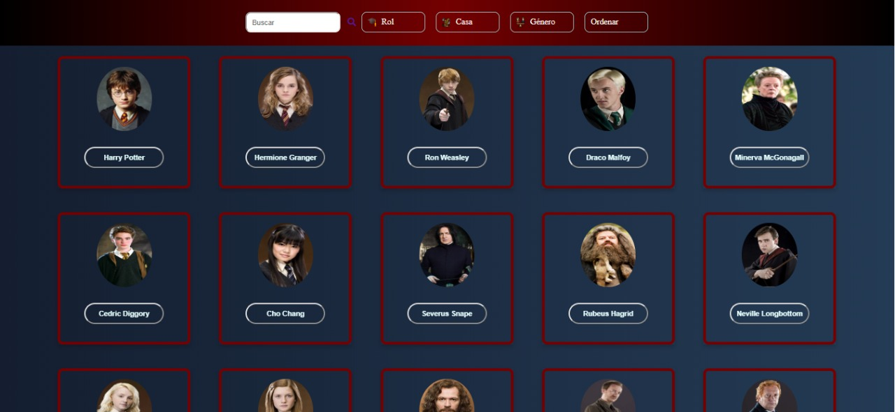
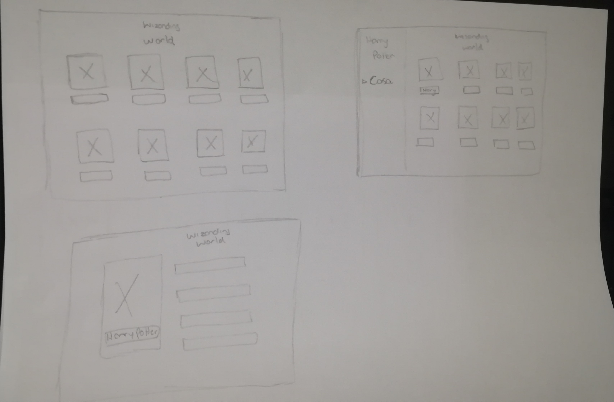
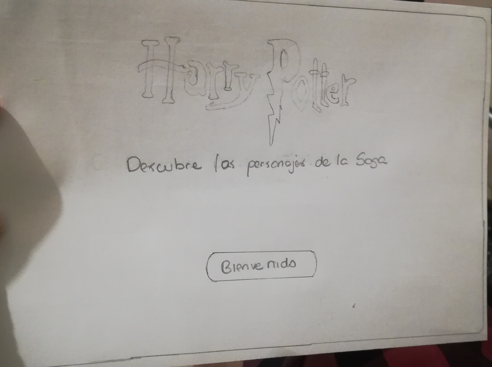
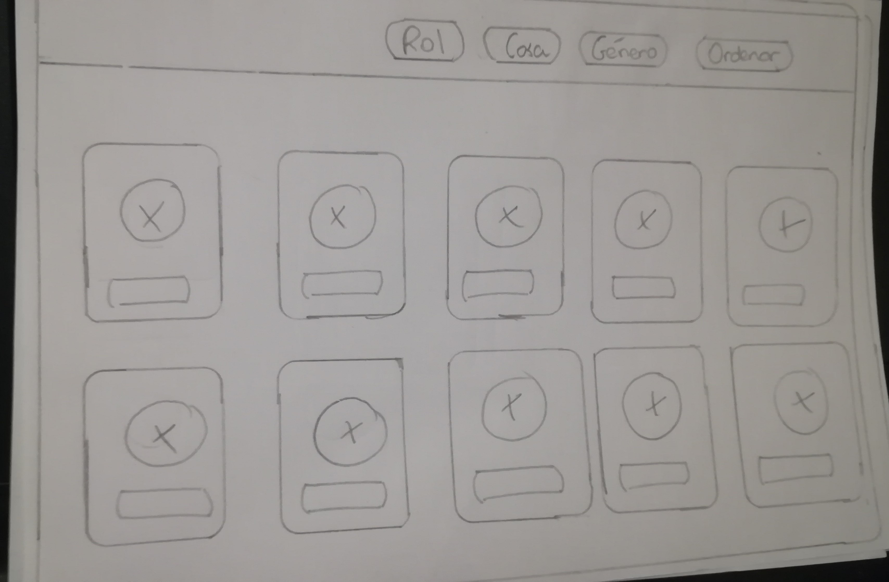
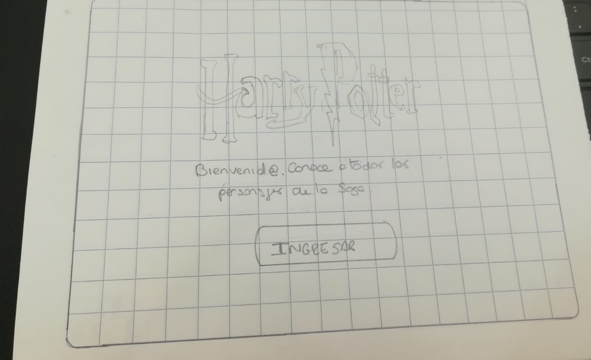
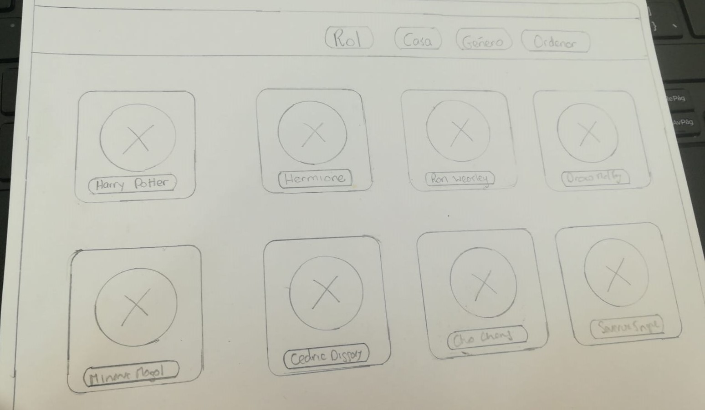
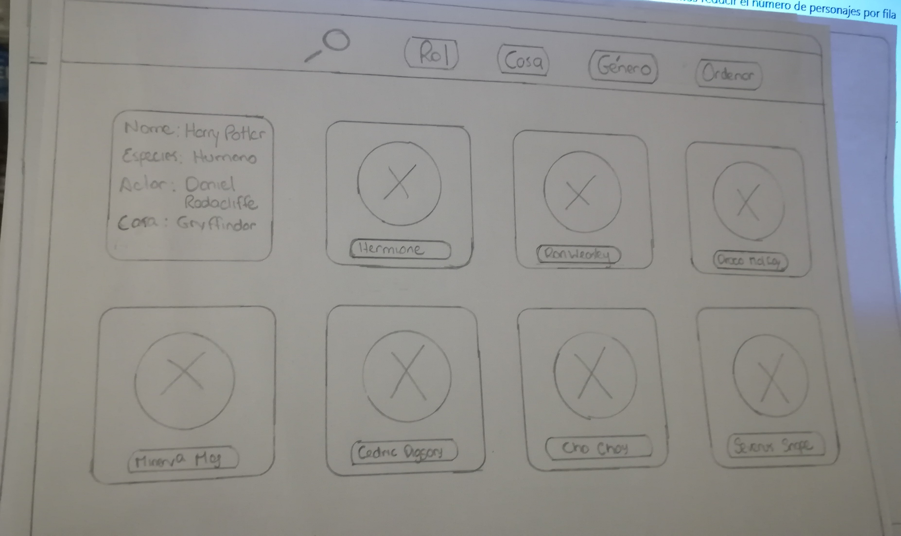
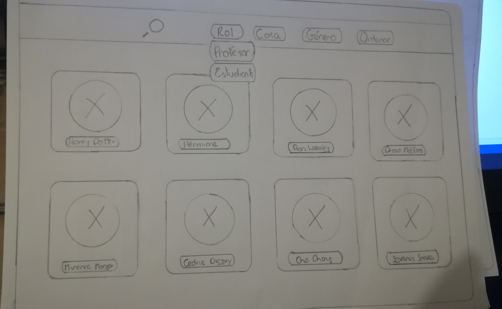
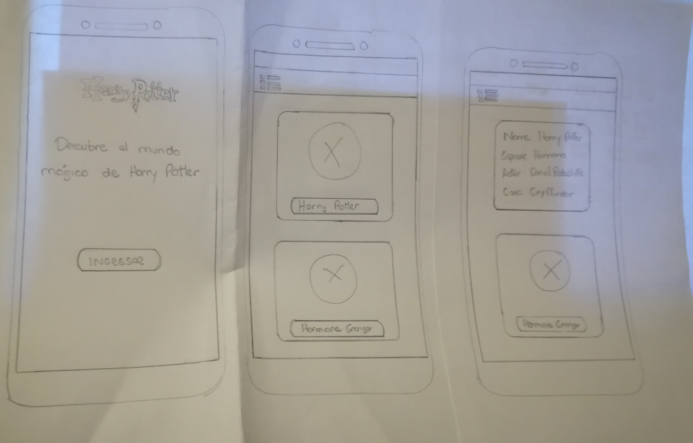
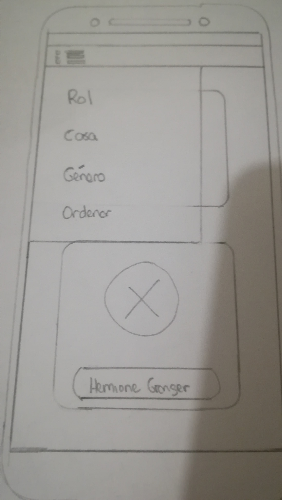

# Data Lovers

## Índice

* Titulo de Proyecto:
* Resumen:
* Objetivos:
* Investigación UX:

    1. Descubrimiento e Investigacion (Research):
    2. Síntesis y definición:
    3. Ideación:
    4. Prototipado:
     
       * Prototipo de baja fidelidad:
       * Prototipo de mediana fidelidad:
       * Prototipo de alta fidelidad:

    5. User Testing:

  ## Titulo de Proyecto
  **Harry Potter**

  ## Resumen
  Harry Potter es una aplicación web dirigida a usuarios que sigan la saga y estén empezando o jueguen “Harry Potter: Wizards Unite; y que estén interesados en saber más de sus personajes.

  ## Objetivos

  El objetivo de la aplicación web es que los usuarios puedan visualizar todos los personajes de la saga y sus características para así entender y ser un mejor jugador de “Wizarding World” o El Mundo Mágico de Harry Potter. 
  Nuestra aplicación ayudará al usuario a:
* Conocer las características de los personajes (nombre, especie, casa, edad, rol etc.). Porque es importante estar en la casa de su personaje favorito en el juego.
*	Saber qué varitas tienen todos los personajes: esto lo ayudará a batallar contra un incontratus en el juego.
* Ver los roles de todos los personajes, quiénes son profesores o estudiantes para que de esta manera pueda tomar como referencia a su personaje favorito al convertirse en mago o bruja.
* Ver el pratonum de su personaje favorito y saber si coincide con el que tiene en el juego.

## Investigación UX
1. Descubrimiento e Investigacion (Research):

El primer libro de Harry Potter salió a la venta en el 1997 y se hizo una película basada en el mismo en el 2001. Lo que quiere decir que nuestros usuarios han crecido con los personajes. La mayoría de ellos empezó a leer y ver la saga a los 8 años aproximadamente, ahora los fans tienen más de 40 años y comparten la saga con sus hijos, hermanos y sobrinos más pequeños. Siendo una historia para niños y adultos de género indistinto. Por eso “Harry Potter: Wizards Unite” ha sido uno de los juegos más esperado del 2019.
 Los usuarios del juego se convierten en "Brujas o magos”; ellos necesitan y desean saber las características de sus personajes favoritos para interactuar en el juego.

2. Síntesis y definición: 

En esta etapa observamos que nuestros usuarios crecieron con la saga y que lo comparten con las demás generaciones. Entonces nuestra aplicación también va dirigido a las familias donde padres y madres comparten con sus hijos e hijas. 

3.	Ideación

Se idearon y maquetaron varias posibles propuestas para cada funcionalidad a implementar. Elaboramos sketches utilizando la herramienta de Brainstorming.

4.	Prototipado
En éste punto se procede a unir insights adquiridas en el proceso de Ideación y los feedbacks para lograr obtener una interfaz adecuada y y amigable para el tipo de usuario.

* Feedback:
El usuario indica que “Bienvenido” solo indica un género y que no se siente a gusto con esa palabra. Además que preferiría que el botón diga “Ingresar”.
Además no indicó que deberíamos reducir el número de personajes por fila para que no se vea desordenado.

*	Despues del feedback
Se reconoció que la interfaz ideada no era amigable y se realizó los cambios. 

* Prototipo de alta fidelidad:
