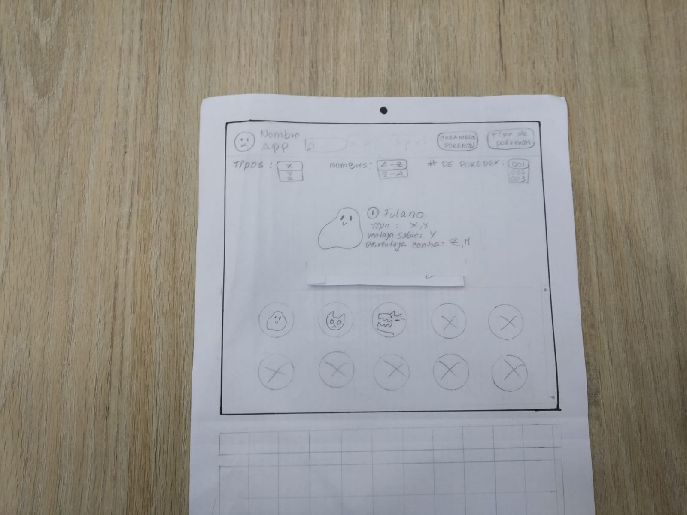
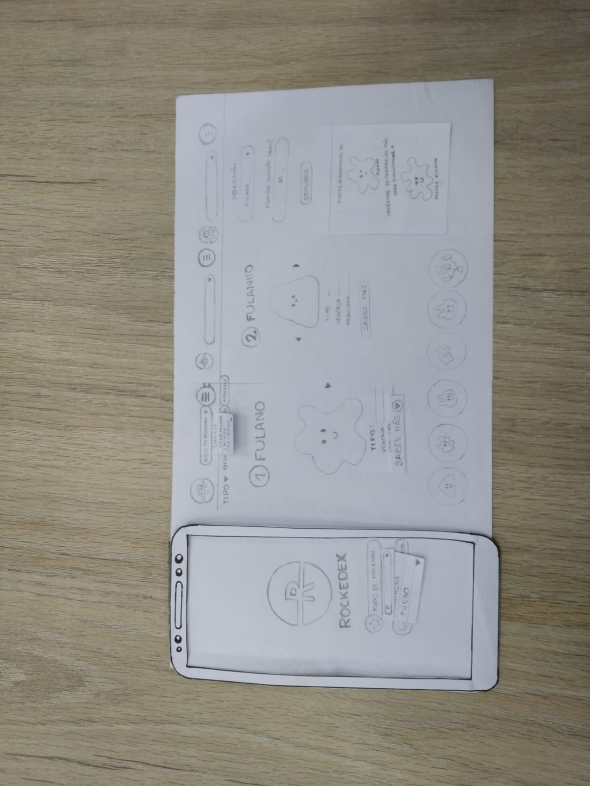
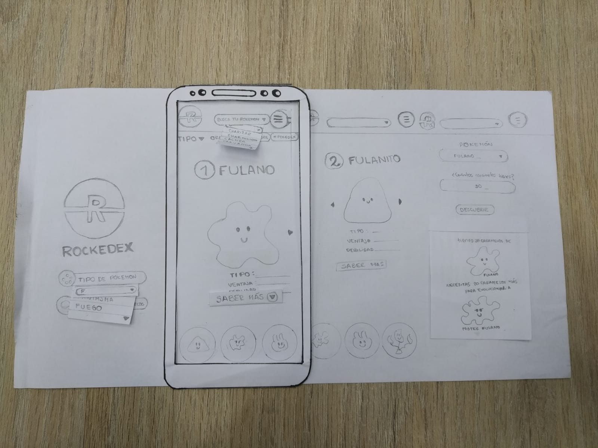
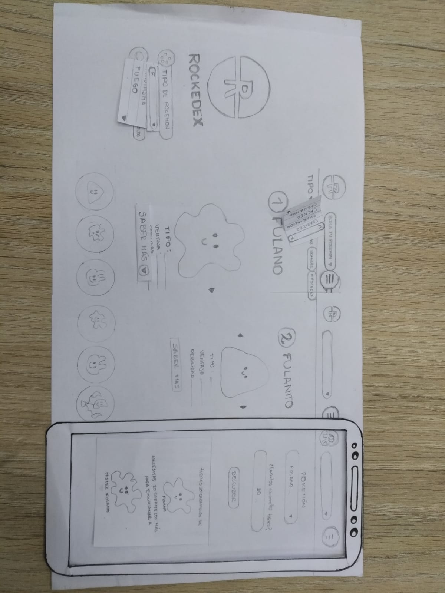

# Data Lovers(POKEMÓN GO)

## Índice

* [1. Contexto](#1-Contexto)
* [2. Resumen del proyecto](#2-resumen-del-proyecto)
* [3. Definición del usuario](#3-Definición-del-usuario)
* [4. Historia de usuario](#4-Historia-de-usuario)
* [5. Prototipado](#5Prototipado)
* [6. Diseño final](#6-diseño-final)
* [7. Objetivos de aprendizaje](#7-objetivos-de-aprendizaje)

***

## 1. Contexto

El inicio de este trabajo se desarrolla en el contexto del Bootcamp de Laboratoria. Desafío Data Lovers.

Cuándo: La duración para el desarrollo del proyecto fue de 4 semanas.

Problema/meta general: 
Construir una página web  que pueda funcionar en modo responsive en distintas plataformas como celulares, donde las personas puedan visualizar un conjunto de datos que se adecúe a lo que descubramos que el usuario necesita: Un pokedex.

El Pokédex en el mundo de Pokémon, es una enciclopedia portátil de alta tecnología que los Entrenadores Pokémon llevan consigo para registrar las fichas de todas las diversas especies Pokémon con las que se encuentran durante su viaje como entrenadores (Fuente: Wikipedia).

Equipo: Este proyecto se basa en el trabajo en equipos conformados por duplas, una  de nosotras sin conocer muy bien del juego Pokemon Go, sin embargo nos decidimos por este proyecto, porque teniamos acceso a personas que juganban activamente en la aplicación y f porque nos pareció poder comprender mejor quién iba a ser el usuario de nuestro futuro producto, lo cual nos pareció lo más relevante en ese momento.

## 2. Resumen del proyecto

Resultados y entregas:

Un reporte con las conclusiones clave respecto al trabajo con los usuarios y los patrones de interacción.

Una página web que permita visualizar la data, filtrarla, ordenarla y hacer algún cálculo de evoluciones agregado.

Status: Finalizado.

## 3. Definición del usuario

Comenzamos con una búsqueda online para conocer las aplicaciones disponibles que den información sobre Pokemon Go. Encontramos dos sitios principales Pokedex.com y Pokedex.org.

Ambos sitios proporcionan una idea de nuestro objetivo en cuanto al modo de presentar la información, de realizar búsquedas y filtros de los distintos pokémon.

A partir de esta búsqueda inicial, comenzamos un testeo de usuario, para eso nos acercamos a varias personas que son jugadores de Pokémon Go, para conocer de qué manera nuestra aplicación les podría servir. Conversamos con 5 de ellos y realizamos preguntas como:

1.- ¿Qué información es relevante conocer para ti? (peso, altura, debilidad, eggs, etc. respecto a lo disponible en la base de datos proporcionada para el desafío).

2.- ¿Para qué necesitarías esta información? (cuándo, cómo, por qué).

3.- En orden de prioridades ¿Cuál consideras es la más relevante para ti?

Nos dimos cuenta que los entrevistados se dividian en dos grandes partes, los novatos y los que ya tenian jugando la aplicación por un largo tiempo pero en ambos casos existia una necesidad de saber el tipo de pokemón y sus cualidades respecto a otros ya que esta información les ayudaria a escoger mejor a la hora de una batalla ya que no es tan precisa en la aplicación, tambien encontramos la duda de cuantos caramelos necesita cada pokemón para evolucionar ya que la aplicación no cuenta con un filtro de este tipo, tambien pudimos observar que los jugadores de nivel superior, buscaban los pokemones de manera más personalizada ya que sabian el nombre del pokemón con exactitud.

Definición del usuario

Un jugadores de Pokemon Go, que quiera conocer/informarse de los pokemones de la Región de Kanto que les ayudaran a mejorar como entrenador y convertirse en MAESTRO POKÉMON.

## 4. Historia de usuario

1. Enunciado: "Yo como usuario de la aplicación" (spring 1)

Quiero filtrar el listado de Pokemones por tipo, para que sea más fácil y rápido encontrar las caracteristicas, debilidades y fortalezas del pokemon que busco con respecto a los otros.

Criterios de Aceptación:

- [x] Quiero que el filtrado se muestre en una lista desplegable y autocompletable.
- [x] Quiero que en la búsqueda aparezca el nombre, número de pokedex, la foto del pokemon y sus debilidades.
- [x] Quiero que la página sea visible en el móvil y en mi computador.

2. Enunciado: "Yo como usuario de la aplicación" (spring 2)

Quiero ordenar el listado de pokemones: Alfabéticamente (A-Z, y/o Z-A) y por número de ID (Menor a mayor). Para que sea más fácil y rápido encontrar el pokemon que busco.

Criterios de Aceptación:

- [x] Quiero elegir la opción de orden (AZ, ZA ó id ascendente)
- [x] Quiero ordenar de la A a la Z
- [x] Quiero ordenar de la Z a la A
- [x] Quiero ordenar el id número de forma ascendente

3. Enunciado: "Yo como usuario de la aplicación" (spring 3)
Quiero saber si mi pokemon puede evocionar, cuantos caramelos más de los que tengo necesita para hacerlo y completar mi pockedex.

Criterios de Aceptación:

- [x] Quiero que al buscar un pokemón se muestre en una lista desplegable y autocompletable.
- [x] Quiero saber si el pokemon que selecione se puede evolucionar.
- [x] Quiero saber la información del pokemon al cual podría evolucionar mi pokemon actual.
- [x] Quiero que la aplicación me permita colocar el número de caramelos que tengo actualmente  y me devuelva la cantidad que me falta para evolucionarlo.

4. Enunciado: "Yo como usuario de la aplicación" (spring 4)
Quiero filtrar del listado de Pokemones por nombre específico y saber todas sus caracteristicas.

Criterios de Aceptación:

- [x] Quiero encontrar las características de un solo pokemón en específico.
- [x] Quiero que el filtrado se muestre en una lista desplegable y autocompletable.
- [x] Quiero acceder a este filtro de manera rápida.

## 5. Prototipado

### Prototipado baja definición
El paso siguiente corresponde al prototipado de baja definición, aquí comenzamos ideando e iterando sobre cómo debería verse la aplicación, y qué elementos debería contener para llegar a nuestra meta.

Primeras ideas: Luego de otorgado el desafío, comenzamos a idear la mejor forma de resolverlo, para eso hicimos los primeros bosquejos del producto. Pensamos en poner un bóton desplegable para filtrar, y otros botones para ordenar. Además pensamos en añadir un buscador.

Organizando ideas: Evaluamos la posibilidad de que el usuario pudiera hacer Login a la aplicación para ingresar a ella, pero esta idea la dejamos para una segunda etapa, en caso de quedar tiempo para ello. Y finalmente pensamos que al hacer click en la imagen del Pokemon se abriera una pantalla desplegable para visualizar información detallada del Pokemon seleccionado.

### Primer testeo de usuario

En esta etapa del trabajo tuvimos un espacio dentro del Bootcamp para compartir el trabajo entre nuestros squad, así tuvimos la oportunidad de recibir feedback del prototipo inicial, así como de ver la ideas de otras alumnas, de tal manera de mejorar la calidad de los trabajos e incorporar nuevas ideas.

Lo que aprendimos:

Centrarnos en lo más relevante de este desafío (filtrar, ordenar y manipular la data) para que nuestra aplicación sea un MVP (Producto Mínimo Viable), por esa razón y gracias al feedback inmediato de nuestras compañeras dejamos: el Login, la casilla de búsqueda, y la información detallada mediante botón de saber más, como una tareas a futuro.
De este modo, este insumo nos sirvió para modificar nuestro prototipo inicial y convertirlo en el prototipo de alta fidelidad,

### Prototipado alta definición
En esta etapa también decidimos incorporar la herramienta de Figma, esto fue un desafío personal, para aprender una nueva herramienta, así como una mejor presentación de la información.

Aquí comenzamos a definir más claramente lo que queríamos lograr, esta vez cambiando los colores por unos más claros.

Para interactuar con el prototipo realizado en el programa "Figma" puedes ingresar en el siguiente link:
https://www.figma.com/file/oyuj9pjJ5Dy3hzZsNgFPcF/Rockedex?node-id=0%3A1

## 6. Diseño Final
Nombre
Elegimos como nombre de nuestra aplicación web: Rockedex, haciendo alusión al equipo Rocket para darle un espíritu más lúdico y diferente. La tipografía elegida es Sans-serif que corresponde a un estilo moderno, debido a que la página que está orientada principalmente a un público jóven. 
Paleta de Colores
Elegimos estos colores porque están todos asociados a Pokemon Go, es especifico al equipo Rocket de tal manera que el usuario al acceder a la página inmediatamente entienda que se trata de una aplicación asociada al juego.
La meta del la aplicación web es crear un proceso rápido de resolución de búsqueda de un pokemon. 

## 7. Objetivos de aprendizaje

El objetivo principal de este proyecto es que, entendiendo las necesidades de tus usuarios, aprendas a diseñar y construir una interfaz web donde se pueda visualizar y manipular data.

Revisa la lista y reflexiona sobre los objetivos que conseguiste en el proyecto anterior. Piensa en eso al decidir tu estrategia de trabajo individual y de equipo.

Vilmarys:
### UX

- [x] Diseñar la aplicación pensando y entendiendo al usuario.
- [x] Crear prototipos para obtener _feedback_ e iterar.
- [x] Aplicar los principios de diseño visual (contraste, alineación, jerarquía).
- [x] Planear y ejecutar _tests_ de usabilidad.

### HTML y CSS

- [x] Identificar y entender tipos de selectores en CSS.
- [ ] Entender como funciona `flexbox` en CSS.
- [x] Construir tu aplicación respetando el diseño planeado (maquetación).

### DOM

- [x] Entender y reconocer los selectores del DOM (querySelector | querySelectorAll).
- [x] Manejar eventos del DOM. (addEventListener)
- [ ] Manipular dinámicamente el DOM. (createElement, appendchild, innerHTML, value)

### Javascript

- [x] Manipular arrays (`filter` | `map` | `sort` | `reduce`).
- [x] Manipular objects (key | value).
- [x] Entender el uso de condicionales (`if-else` | `switch`).
- [x] Entender el uso de bucles (`for` | `forEach`).
- [x] Entender la diferencia entre expression y statements.
- [x] Utilizar funciones (parámetros | argumentos | valor de retorno).
- [ ] Entender la diferencia entre tipos de datos atómicos y estructurados.
- [x] Utilizar ES Modules (`import` | `export`).

### Pruebas Unitarias (_testing_)
- [x] Testear funciones (funciones puras).

### Git y GitHub
- [x] Ejecutar comandos de git (`add` | `commit` | `pull` | `status` | `push`).
- [x] Utilizar los repositorios de GitHub (`clone` | `fork` | gh-pages).
- [x] Colaborar en Github (pull requests).

### Buenas prácticas de desarrollo
- [x] Organizar y dividir el código en módulos (Modularización).
- [ ] Utilizar identificadores descriptivos (Nomenclatura | Semántica).
- [x] Utilizar linter para seguir buenas prácticas (ESLINT).

Rubí:
### UX

- [x] Diseñar la aplicación pensando y entendiendo al usuario.
- [x] Crear prototipos para obtener _feedback_ e iterar.
- [x] Aplicar los principios de diseño visual (contraste, alineación, jerarquía).
- [x] Planear y ejecutar _tests_ de usabilidad.

### HTML y CSS

- [x] Identificar y entender tipos de selectores en CSS.
- [ ] Entender como funciona `flexbox` en CSS.
- [x] Construir tu aplicación respetando el diseño planeado (maquetación).

### DOM

- [ ] Entender y reconocer los selectores del DOM (querySelector | querySelectorAll).
- [x] Manejar eventos del DOM. (addEventListener)
- [ ] Manipular dinámicamente el DOM. (createElement, appendchild, innerHTML, value)

### Javascript

- [ ] Manipular arrays (`filter` | `map` | `sort` | `reduce`).
- [ ] Manipular objects (key | value).
- [ ] Entender el uso de condicionales (`if-else` | `switch`).
- [x] Entender el uso de bucles (`for` | `forEach`).
- [ ] Entender la diferencia entre expression y statements.
- [x] Utilizar funciones (parámetros | argumentos | valor de retorno).
- [ ] Entender la diferencia entre tipos de datos atómicos y estructurados.
- [x] Utilizar ES Modules (`import` | `export`).

### Pruebas Unitarias (_testing_)
- [ ] Testear funciones (funciones puras).

### Git y GitHub
- [x] Ejecutar comandos de git (`add` | `commit` | `pull` | `status` | `push`).
- [x] Utilizar los repositorios de GitHub (`clone` | `fork` | gh-pages).
- [x] Colaborar en Github (pull requests).

### Buenas prácticas de desarrollo
- [ ] Organizar y dividir el código en módulos (Modularización).
- [x] Utilizar identificadores descriptivos (Nomenclatura | Semántica).
- [ ] Utilizar linter para seguir buenas prácticas (ESLINT).
