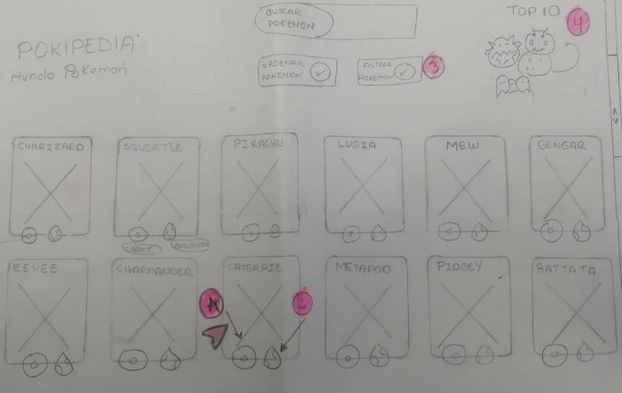

## Objetivos de aprendizaje

El objetivo principal de este proyecto es que, entendiendo las necesidades de
tus usuarios, aprendas a diseñar y construir una interfaz web donde se pueda
visualizar y manipular data.

Revisa la lista y reflexiona sobre los objetivos que conseguiste en el
proyecto anterior. Piensa en eso al decidir tu estrategia de trabajo individual
y de equipo.

### UX

- [X] Diseñar la aplicación pensando y entendiendo al usuario.
- [X] Crear prototipos para obtener _feedback_ e iterar.
- [X] Aplicar los principios de diseño visual (contraste, alineación, jerarquía).
- [X] Planear y ejecutar _tests_ de usabilidad.

### HTML y CSS

- [X] Entender y reconocer por qué es importante el HTML semántico.
- [X] Identificar y entender tipos de selectores en CSS.
- [X] Entender como funciona `flexbox` en CSS.
- [X] Construir tu aplicación respetando el diseño planeado (maquetación).

### DOM

- [ ] Entender y reconocer los selectores del DOM (querySelector | querySelectorAll).
- [X] Manejar eventos del DOM. (addEventListener)
- [X] Manipular dinámicamente el DOM. (createElement, appendchild, innerHTML, value)

### Javascript

- [ ] Manipular arrays (`filter` | `map` | `sort` | `reduce`).
- [X] Manipular objects (key | value).
- [X] Entender el uso de condicionales (`if-else` | `switch`).
- [X] Entender el uso de bucles (`for` | `forEach`).
- [X] Entender la diferencia entre expression y statements.
- [X] Utilizar funciones (parámetros | argumentos | valor de retorno).
- [X] Entender la diferencia entre tipos de datos atómicos y estructurados.
- [X] Utilizar ES Modules (`import` | `export`).

### Pruebas Unitarias (_testing_)
- [X] Testear funciones (funciones puras).

### Git y GitHub
- [X] Ejecutar comandos de git (`add` | `commit` | `pull` | `status` | `push`).
- [X] Utilizar los repositorios de GitHub (`clone` | `fork` | gh-pages).
- [ ] Colaborar en Github (pull requests).

### Buenas prácticas de desarrollo
- [X] Organizar y dividir el código en módulos (Modularización).
- [X] Utilizar identificadores descriptivos (Nomenclatura | Semántica).
- [X] Utilizar linter para seguir buenas prácticas (ESLINT).

# DATA LOVERS - POKIPEDIA

## Índice

* [1. Resumen del proyecto](#1-resumen-del-proyecto)
* [2. Definición del producto](#2-definición-del-producto)
* [3. Investigación UX](#3-investigación-UX)
* [4. Historias de usuario](#4-historias-de-usuario)
* [5. Diseño de la Interfaz de Usuario](#5-Diseño-de-la-Interfaz-de-Usuario)
* [6. Imagen del proyecto final](#6-imagen-del-proyecto-final)

***

## 1. Resumen del proyecto

En este proyecto se construyo una pagina web referente a POKEMON donde el usuario podra saber toda la informacion detallada de los 151 primeros pokemon. Podra navegar y ver el tipo, debilidades, peso, promedio de aparacion y sus evoluciones.

## 2. Definición del producto

El juego POKEMON GO fue lanzado en verano del 2016 y es jugado por millones de personas en todo el mundo y cada vez mas personas se suman a ello.

Es por eso que en este proyecto se construyo una pagina web referente a los 151 pokemon con sus respectivas estadisticas para que el usuario pueda tener mayor conocimiento de ellos de una manera rapida y sencilla.

## 3. Investigación UX

Pokémon GO es una experiencia de juego internacional que cuenta con más de mil millones de descargas y ha sido nombrada "el mejor juego para móviles" por Game Developers Choice Awards y "la mejor aplicación del año" por TechCrunch (tomado de Google Play). Los usuarios del juego se convierten en "Maestros/ entrenadores de Pokémon" y pueden:

* Descubrir el mundo Pokémon: explorar y descubrir nuevos Pokémon allá donde vayan.
* Atrapar distintos Pokémon para completar su Pokédex.
* Pelear contra Pokémon de otros entrenadores y conquistar un gimnasio.
* Competir en épicos combates contra otros entrenadores.
* Hacer equipo con otros entrenadores para atrapar poderosos Pokémon durante las incursiones.

Para entender mejor qué necesidades complementarias a la app tienen los usuarios, hicimos una rápida investigación (research) y estos son algunos de los hallazgos.

* Los Pokémon tienen características únicas que determinan las decisiones que toma el usuario (tipo, debilidad, peso, multiplicador, etc.)
* Un maestro Pokémon antes de salir a casar los Pokémon tienen que: saber el top 10 de frecuencia de aparición de los Pokémon.
* Los Pokémon tienen distintos tipos y debilidades de combate. Estas características son importantes cuando un maestro Pokémon elige al Pokémon más adecuado para su batalla. Hay veces que tiene que elegir a los que tienen menos cantidad de debilidades y saber de que tipo son. Por ello, es importante para un maestro Pokémon poder ordenarlos por estas 2 características.
* Los Pokémon evolucionan y es importante para un maestro Pokémon saber cuántas y cuáles son las evoluciones que tienen antes y después.
* Los Pokémon se alimentan de caramelos y un maestro Pokémon necesita saber cuántos caramelos necesita un Pokémon para evolucionar.

## 4. Historias de usuario

Durante el desarrollo del proyecto se realizo las siguientes historias de usuario: 

4.1. Yo como usuario quiero ver el nombre, imagen y las características principales de todos los pokemones para elegir el más adecuado.

  * DEFINICIÓN DE TERMINADO
      - El código cumple con la guía de estilos guardada (Eslint).
      - El código esta en el repositorio.
      - La historia a sido testeada por lo menos en 3 usuarios.
      - La historia a pasado por FeedBack de compañeras.
      - La publicación en el GitHub-pages.

  * CRITERIOS DE ACEPTACIÓN
      - El usuario puede ver la lista de nombres e imágenes de todos los pokemones.
      - El usuario puede seleccionar un pokemon y aparecen sus características (peso, tamaño,    tipo y debilidades).
      - El usuario puede visualizar la información en desktop.
      - El usuario puede visualizar la informacion en celular.

4.2. Yo como usuario quiero filtrar los pokemon por su tipo y por debilidades para poder ver    quienes son los más fuertes.

   * DEFINICIÓN DE TERMINADO
      - El código cumple con la guía de estilos guardada (Eslint).
      - El código esta en el repositorio.
      - La historia a sido testeada por lo menos en 3 usuarios.
      - La historia a pasado por FeedBack de compañeras.
      - La publicación en el GitHub-pages. 

   * CRITERIOS DE ACEPTACIÓN
      - El usuario puede filtrar a los pokemon por su tipo(agua, fuego, veneno, etc).
      - El usuario puede filtrar a los pokemon por sus debilidades (arena, roca, agua, etc).
      - El usuario puede filtrar a los pokemon por sus Km Huevo (2km, 5km, 10km).
      - El usuario puede eliminar el filtro y volver a mostrar los 151 pokemon.
      - El usuario puede visualizar la informacion en desktop.
      - El usuario puede visualizar la informacion en celular.

4.3. Yo como usuario quiero ordenar los pokemon por id y nombre de forma ascendente y descendente. 

  * DEFINICIÓN DE TERMINADO
      - El código cumple con la guía de estilos guardada (Eslint).
      - El código esta en el repositorio.
      - La historia a sido testeada por lo menos en 3 usuarios.
      - La historia a pasado por FeedBack de compañeras.
      - La publicación en el GitHub-pages. 

   * CRITERIOS DE ACEPTACIÓN
      - El usuario puede ordenar por su nombre (A - Z) o (Z - A).
      - El usuario puede ordenar por su id (1 - 151) o (151 - 1).
      - El usuario puede visualizar la informacion en desktop.
      - El usuario puede visualizar la informacion en celular.

4.4. Yo como usuario quiero saber el top 10 de los pokemones que mas aparecen.

  * DEFINICIÓN DE TERMINADO
      - El código cumple con la guía de estilos guardada (Eslint).
      - El código esta en el repositorio.
      - La historia a sido testeada por lo menos en 3 usuarios.
      - La historia a pasado por FeedBack de compañeras.
      - La publicación en el GitHub-pages. 

  * CRITERIOS DE ACEPTACIÓN
      - El usuario ve la imagen, el nombre del pokemon y los indicadores de aparición.
      - El usuario puede visualizar la información en desktop.
      - El usuario puede visualizar la información en celular.

4.5. Yo como usuario quiero ver los nombres e imágenes de las evoluciones de todos los pokemon.

  * DEFINICIÓN DE TERMINADO
      - El código cumple con la guía de estilos guardada (Eslint).
      - El código esta en el repositorio.
      - La historia a sido testeada por lo menos en 3 usuarios.
      - La historia a pasado por FeedBack de compañeras.
      - La publicación en el GitHub-pages. 

  * CRITERIOS DE ACEPTACIÓN
      - El usuario al hacer click en el botón de evoluciones, visualiza las evoluciones del pokemon junto a su  imagen correspondiente.
      - El usuario puede visualizar la información en desktop.
      - El usuario puede visualizar la información en celular.

4.6. Yo como usuario quiero buscar el pokemon por su nombre y que aparezcan sus características.

  *  DEFINICIÓN DE TERMINADO
        - El código cumple con la guía de estilos guardada (Eslint).
        - El código esta en el repositorio.
        - La historia a sido testeada por lo menos en 3 usuarios.
        - La historia a pasado por FeedBack de compañeras.
        - La publicación en el GitHub-pages.
        
   *  CRITERIOS DE ACEPTACIÓN
        - El usuario escribe el nombre del pokemon que esta buscando y aparece las características del pokemon.
        - El usuario puede visualizar la información en desktop.
        - El usuario puede visualizar la información en celular.

## 5. Diseño de la Interfaz de Usuario

#### Prototipo de baja fidelidad

* Pantalla de inicio

* Pantalla de modal

* Pantalla de top

* Pantalla evoluciones

* Pantalla General

#### Prototipo de alta fidelidad

Los prototipos de alta fidelidad fueron realizados en FIGMA.

* Pagina WEB

   *Enlace Figma - Web:  [click aqui](https://www.figma.com/proto/uZE6beWby4IaarGxVnSh4f/Untitled?node-id=57%3A485&scaling=scale-down)*

* Dispositivos Mobiles

  *Enlace Figma - Mobil: [click aqui](https://www.figma.com/proto/Dob9UqshMPMDKL5xlRzQXd/Untitled?node-id=1%3A2&scaling=scale-down)*

#### Testeos de usabilidad

* Eliminar la pantalla de inicio.
* No hacer carrusel infinito porque no permite ver la información.
* Hacer un modal para ver las caracteristicas del pokemon.
* Incluir las evoluciones dentro del pokemon.

## 6. Imagen del Proyecto Final.

* Pagina WEB

* Dispositivos Mobiles

  